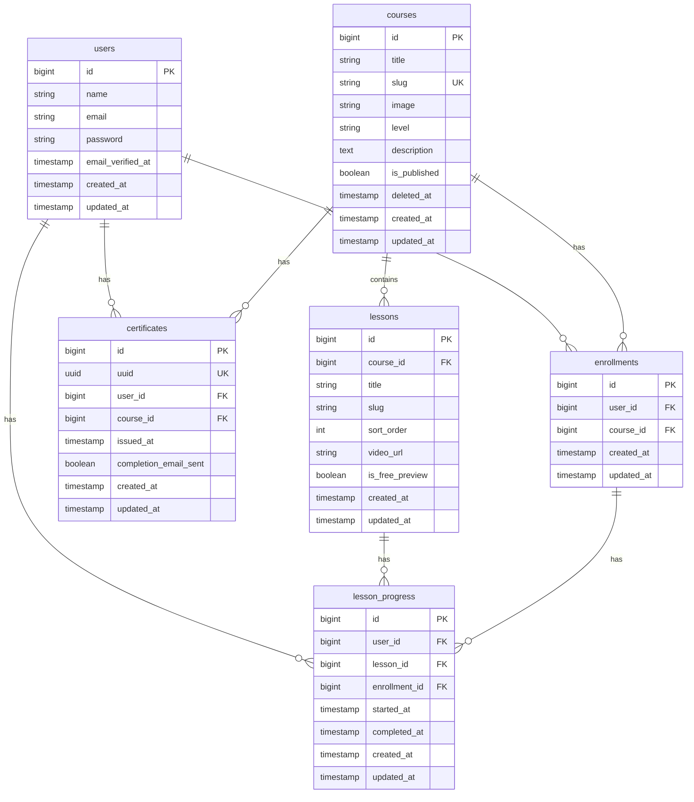

# Entity Relationship Diagram

## Key constraints

- **courses**: `slug` unique (soft deletes: row remains so slug is still reserved).
- **lessons**: `(course_id, slug)` unique.
- **enrollments**: `(user_id, course_id)` unique.
- **lesson_progress**: `(user_id, lesson_id)` unique.
- **certificates**: `uuid` unique, `(user_id, course_id)` unique.
